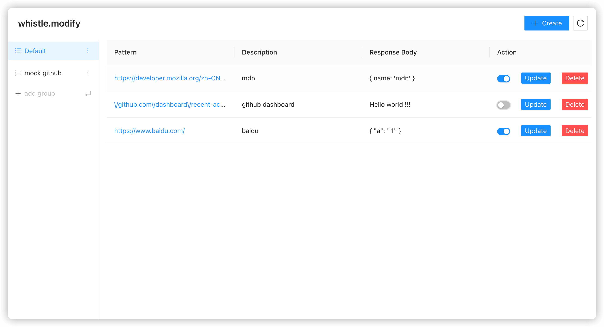
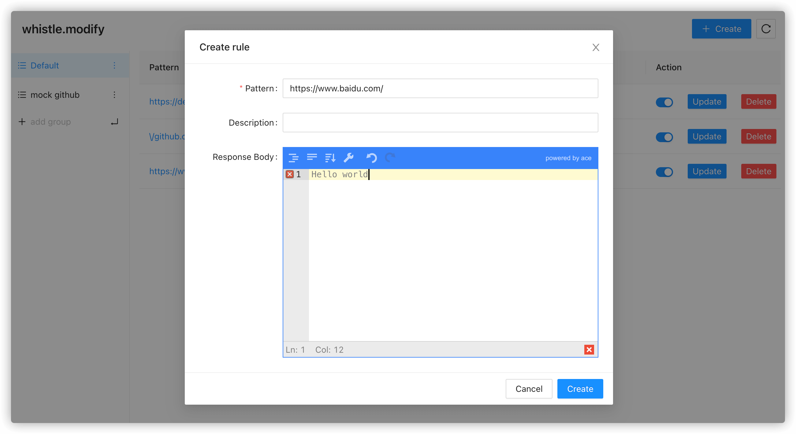
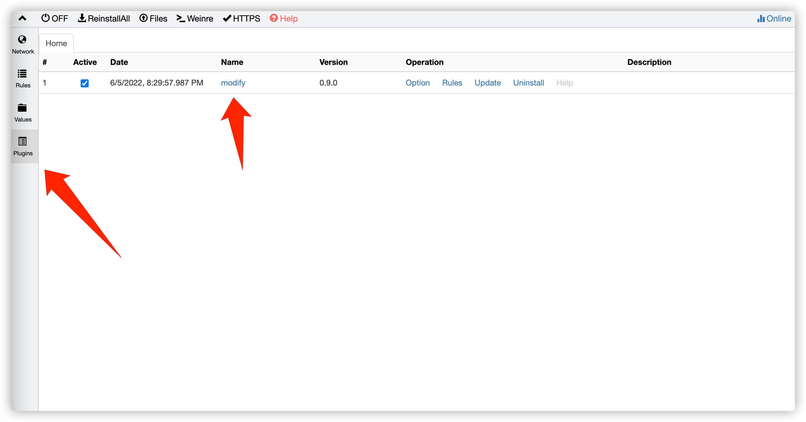
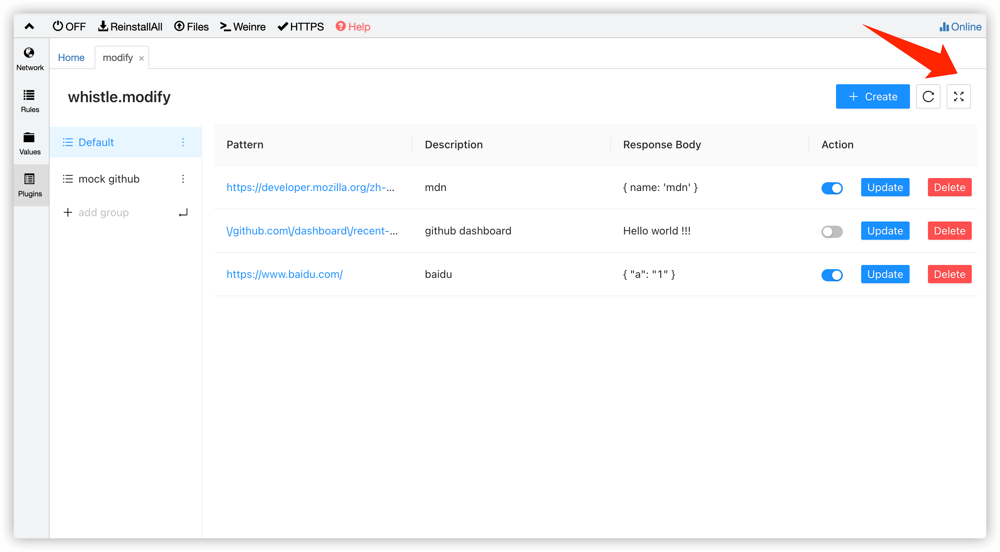
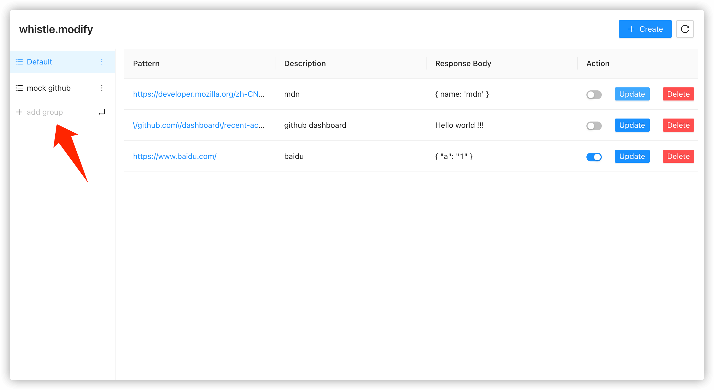

# whistle.modify

一个用于修改响应的 [whistle](http://wproxy.org/whistle/) 插件。





## 开始使用

### 安装配置 whistle

具体查看 [whistle install](http://wproxy.org/whistle/install.html)，确保你想要的调试的请求都通过 `whistle` 代理。

### 安装插件

```sh
npm i -g whistle.modify
```

### 打开插件

### 在 whistle 的插件管理页面中使用



### 在独立的浏览器 `tab` 中打开使用

在 `plugins` 管理页面打开之后，也可继续点击箭头指向的右侧按钮，在独立的 `tab` 中打开使用。



## 功能

### 创建 rule

每一条用于修改的规则逻辑称为 `rule`，点击右上角的 `create` 在弹出的 `modal` 填写以下信息创建 `rule`。

- `pattern`: 如果 `pattern` 与 `request URL` 相匹配，那么该 `rule` 则会对此请求生效。

  目前 `pattern` 支持使用 [indexOf](https://developer.mozilla.org/zh-CN/docs/Web/JavaScript/Reference/Global_Objects/Array/indexOf) 以及正则匹配。
  所以有效的 `pattern` 可以是 `https://www.baidu.com/` 也可以是 `\/github.com\/dashboard\/recent-activity$`。

- `description`: `rule` 的描述，选填，对 `rule` 进行备注，方便查找。

- `response body`: 修改之后的响应体。

### 管理 rule

`Table` 的 `Action` 一栏。

- 启用/禁用 `rule`。
- 更新 `rule`。
- 删除 `rule`。

### 分组管理

当 `rules` 较多的时候，可通过创建不同的分组来对 `rules` 进行分类、管理。


